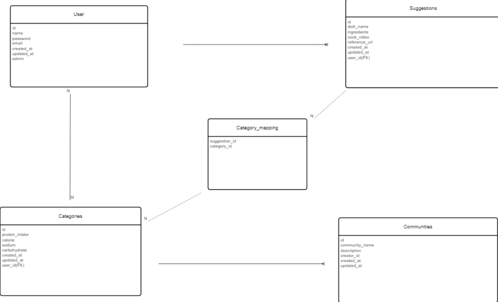
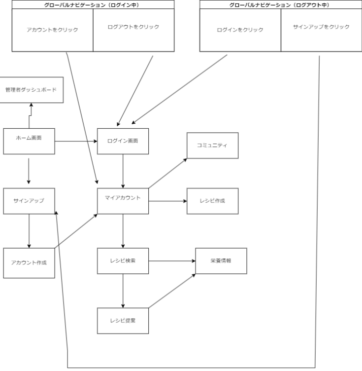

開発言語 Ruby 3.0.1 Rails 6.1.7 PostgreSQL 12.8

実行手順 $ git clone https://github.com/aikahedwig/cook_suggestion.git $ cd cook_suggestion $ bundle install $ rails db:create && rails db:migrate $ rails s

カタログ設計書 https://docs.google.com/spreadsheets/d/1hFDkyIjAa1UM2Af9zOLLM8nUkn-DzGHPWjwfnmBjIQ0/edit#gid=782464957

テーブル定義書 https://docs.google.com/spreadsheets/d/1hFDkyIjAa1UM2Af9zOLLM8nUkn-DzGHPWjwfnmBjIQ0/edit#gid=2020033787

ワイヤーフレーム https://app.diagrams.net/#G1Pa2d2EGkouhQQ5yjBr5Ea3ayPI7BmeIs#%7B%22pageId%22%3A%22piDafpqhtRUU5qUU-vj8%22%7D

ER図

画面遷移図
